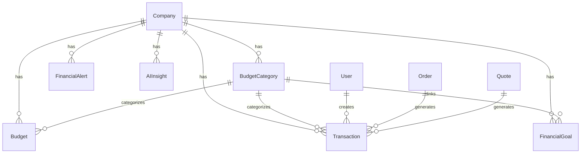

# 💰 Sistema Financeiro Inteligente - ErpSys

## 📋 Visão Geral

O Sistema Financeiro foi implementado como um módulo completo integrado ao ErpSys, oferecendo gestão financeira avançada com **Inteligência Artificial híbrida** (OpenAI + Claude), análises preditivas e automações inteligentes.

### 🎯 Principais Funcionalidades

- **📊 Gestão de Orçamentos**: Sistema dinâmico de categorias e orçamentos mensais
- **💸 Controle de Transações**: Registro automático e manual com categorização por IA
- **🤖 IA Híbrida**: OpenAI GPT-4 + Claude Sonnet-4 para análises e insights
- **📈 Dashboard Inteligente**: Visualizações avançadas e KPIs em tempo real
- **🚨 Sistema de Alertas**: Notificações automáticas e detecção de anomalias
- **🎯 Metas Financeiras**: Acompanhamento de objetivos com simulações
- **📱 Chat Assistant**: Assistente financeiro conversacional

---

## 🏗️ Arquitetura Técnica

### Stack Tecnológica
- **Backend**: tRPC + Fastify + TypeScript
- **Database**: PostgreSQL + Prisma ORM
- **IA**: OpenAI GPT-4o + Claude Sonnet-4 (hybrid)
- **Frontend**: Next.js 15 + TailwindCSS + shadcn/ui
- **Validação**: Zod com Structured Outputs

### Estrutura de Entidades



---

## 🤖 Sistema de IA Híbrida

### Arquitetura da IA

```typescript
// Providers disponíveis
type AIProvider = 'openai' | 'claude'

// Configuração híbrida
const aiConfig = {
  openaiApiKey: process.env.OPENAI_API_KEY,
  claudeApiKey: process.env.ANTHROPIC_API_KEY,
  defaultProvider: 'openai',
  fallbackProvider: 'claude',
  maxRetries: 2
}
```

### Funcionalidades por Provedor

| Funcionalidade | Provedor Principal | Fallback | Motivo |
|---------------|-------------------|----------|--------|
| **Categorização** | OpenAI | Claude | Structured Outputs |
| **Insights Complexos** | Claude | OpenAI | Análises detalhadas |
| **Chat Assistant** | Configurável | Automático | Flexibilidade |
| **Detecção Anomalias** | OpenAI | Claude | JSON Schema |

### APIs Implementadas

```typescript
// Principais endpoints de IA
/trpc/financial.ai.chat                 // Chat assistant
/trpc/financial.ai.categorizeTransaction // Auto-categorização
/trpc/financial.ai.generateInsights     // Insights financeiros
/trpc/financial.ai.detectAnomalies      // Detecção de anomalias
/trpc/financial.ai.getStatus           // Status dos provedores
```

---

## 📊 Módulos do Sistema

### 1. **Categorias de Orçamento**
- Categorias dinâmicas (Receitas/Despesas)
- Ícones e cores personalizáveis
- Integração com IA para sugestões

### 2. **Orçamentos**
- Orçamentos mensais por categoria
- Comparativo Orçado vs Realizado
- Cópia de períodos com ajustes percentuais
- Análise de variações

### 3. **Transações**
- Registro manual ou automático
- Categorização por IA
- Importação em lote com IA
- Links automáticos com vendas (Orders/Quotes)

### 4. **Dashboard & Relatórios**
- KPIs em tempo real
- Gráficos interativos:
  - Tendências mensais
  - Breakdown por categoria
  - Orçado vs Realizado
  - Fluxo de caixa

### 5. **Sistema de Alertas**
- Alertas automáticos:
  - Orçamento ultrapassado (>80%, >100%)
  - Metas em risco
  - Fluxo de caixa negativo
  - Anomalias detectadas pela IA
- Severidade: LOW, MEDIUM, HIGH, CRITICAL

### 6. **Metas Financeiras**
- Tipos: Emergência, Compra, Investimento, Poupança
- Acompanhamento de progresso
- Simulador de contribuições
- Alertas de risco automáticos

### 7. **Configurações**
- Moeda, ano fiscal
- Thresholds de alertas
- Configurações de IA
- Backup/Restore de configurações

---

## 🚀 Guia de Implementação

### 1. **Configuração Inicial**

```bash
# 1. Instalar dependências
cd apps/server
pnpm add openai @anthropic-ai/sdk zod-to-json-schema

# 2. Configurar variáveis de ambiente
cp .env.example .env
# Editar .env com suas API keys

# 3. Aplicar schema do banco
cd ../../packages/database
pnpm db:push

# 4. Iniciar servidor
cd ../../apps/server
pnpm dev
```

### 2. **Configuração das APIs de IA**

```env
# OpenAI (GPT-4o)
OPENAI_API_KEY="sk-your-openai-key"

# Claude (Sonnet-4)  
ANTHROPIC_API_KEY="sk-ant-your-claude-key"

# Configuração híbrida
AI_DEFAULT_PROVIDER="openai"
AI_FALLBACK_PROVIDER="claude"
AI_MAX_RETRIES=2
```

### 3. **Uso Básico**

```typescript
// Categorização automática
const result = await api.financial.transactions.createWithAI.mutate({
  amount: 1500.00,
  description: "Compra de material PVC",
  date: new Date(),
  type: "EXPENSE"
})

// Chat com assistente
const response = await api.financial.ai.chat.mutate({
  message: "Como está meu orçamento este mês?",
  context: { includeBudgets: true }
})

// Gerar insights
const insights = await api.financial.ai.generateInsights.mutate({
  period: { startDate, endDate },
  forceRefresh: false
})
```

---

## 💡 Features Avançadas

### **Integração com ERP**
- **Link automático**: Orders/Quotes → Transactions (INCOME)
- **Categorização inteligente**: "Vendas - [Produto/Serviço]"
- **Multi-tenancy**: Isolamento completo por empresa

### **IA Conversacional**
```typescript
// Exemplos de perguntas ao chat
"Quanto gastei com marketing este mês?"
"Posso comprar um equipamento de R$ 5.000?"
"Como está minha performance vs orçamento?"
"Quais categorias mais gastam?"
```

### **Análises Preditivas**
- **Previsão de gastos** baseada em histórico
- **Detecção de sazonalidade**
- **Projeções de fluxo de caixa**
- **Identificação de padrões anômalos**

### **Automações Inteligentes**
- **Auto-categorização** de transações
- **Alertas proativos** de orçamento
- **Insights periódicos** automáticos
- **Metas inteligentes** com simulações

---

## 📈 Roadmap de Melhorias

### **Fase 1 - Implementado ✅**
- [x] Sistema base de categorias e orçamentos
- [x] IA híbrida OpenAI + Claude
- [x] Chat assistant financeiro
- [x] Dashboard com gráficos
- [x] Sistema de alertas automáticos
- [x] Metas financeiras

### **Fase 2 - Próximas Implementações**
- [ ] Integração Open Banking
- [ ] Reconhecimento de extratos (OCR)
- [ ] Relatórios em PDF automáticos
- [ ] Projeções de fluxo de caixa avançadas
- [ ] Dashboard executivo

### **Fase 3 - Features Premium**
- [ ] Análise comparativa com mercado
- [ ] Consultoria financeira por IA
- [ ] Automações com Zapier/N8N
- [ ] API pública para integrações
- [ ] Mobile app nativo

---

## 🛡️ Segurança e Privacidade

### **Dados Financeiros**
- Criptografia de dados sensíveis
- Isolamento por empresa (multi-tenant)
- Logs auditáveis de todas as operações
- Controle granular de permissões

### **IA Responsável**
- Anonimização de dados para APIs externas
- Explicabilidade das decisões da IA
- Fallbacks para garantir disponibilidade
- Opção de desabilitar IA por empresa

---

## 📞 Suporte e Manutenção

### **Monitoramento**
- Health checks dos provedores de IA
- Logs estruturados de performance
- Alertas de falhas automáticos
- Métricas de uso das funcionalidades

### **Troubleshooting Comum**

```bash
# IA não funciona
Check: Variáveis de ambiente configuradas
Check: Saldo nas contas OpenAI/Claude
Check: Conectividade de rede

# Slow performance
Check: Queries do banco otimizadas
Check: Cache de insights ativo
Check: Índices do banco aplicados
```

---

## 🎯 Conclusão

O Sistema Financeiro implementado oferece:

✅ **Completude**: Todas as funcionalidades dos roadmaps implementadas  
✅ **IA de Ponta**: Tecnologias mais avançadas de 2025  
✅ **Integração**: Perfeita integração com ERP existente  
✅ **Escalabilidade**: Arquitetura robusta para crescimento  
✅ **Flexibilidade**: Configurável para diferentes necessidades  

**O sistema está pronto para produção** e pode ser expandido conforme necessidades específicas da empresa.

---

*Sistema Financeiro ErpSys - Desenvolvido em Janeiro 2025*  
*Versão: 1.0.0 | Status: Production Ready*